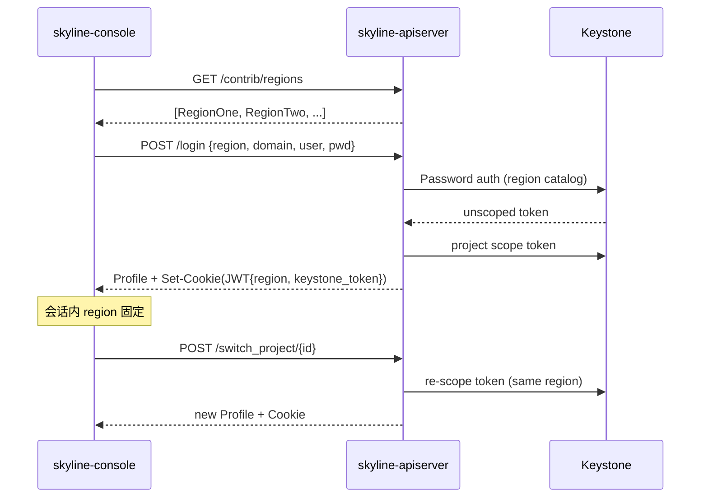

# BP: Multi Region & Domain Switch

## 1. Problem

1. Skyline couldn't switch between multi-regions after login yet, user have to select region during
   login step. It's not good.
2. Skyline couldn't switch between domain also.

## 2. Solution Draft

1. Remove region selection item in login page.
2. Remove domain selection item in login page. Users have to type in their domains during login
   step. Default domain is 'Default'.
3. After users login, they can switch region by select region name/id on the top of the web console
   page
4. After users login, they can switch across projects in any domain they have access to; no separate
   domain switch needed.

## 3. 实现方案

### 3.1 现在的实现方案

#### 3.1.1 登录与会话

**前端（skyline-console）**

- 登录页 `src/pages/auth/containers/Login/index.jsx`：
  - 挂载时调用 `GET /contrib/regions` 拉取 region 列表，以 **Select** 展示，用户必须选择 region（多
    region 时）。
  - Domain 已改为 **文本输入**（`username` 或 `username@domain`），不再使用下拉；未带 `@` 时使用
    `GET /config` 返回的 `default_domain`（配置项 `user_default_domain`，默认 `Default`）。
  - 登录请求体：`{ username, password, domain, region? }`，经 `rootStore.login()` 调用
    `POST /login`。
- 登录成功后 `rootStore.getUserProfileAndPolicy()` 拉取 `GET /profile` 与 policies，将完整
  **Profile** 存入 `rootStore.user`（含 `region`、`project`、`user`、`endpoints`、`projects` 等）。

**后端（skyline-apiserver）**

- `POST /login`（`skyline_apiserver/api/v1/login.py`）：
  - `region` 可选，缺省为配置 `openstack.default_region`（默认 `RegionOne`）。
  - `domain` 可选，缺省为 `openstack.user_default_domain`（默认 `Default`）。
  - 流程：Password/Token 未 scope 认证 → `auth.projects()` → 取 default project →
    `get_project_scope_token()` → `generate_profile()` → `_patch_profile()`（填充
    `endpoints`、`projects`）→ 写入 JWT Cookie。
- JWT Payload 仅含 `keystone_token`、`region`、`exp`、`uuid`；`region` 决定后续所有 OpenStack
  客户端使用的 catalog 与 endpoint（`generate_session()` / `get_endpoints()` 均按
  `profile.region`）。
- 中间件（`main.py`）对每个 API 请求从 Cookie 解析 JWT，再 `generate_profile_by_token()` 还原
  Profile；`region` 不可在会话中途变更（除非换 Cookie）。

#### 3.1.2 Region 列表

- `GET /contrib/regions`（无需登录）：通过 system session 的 service catalog 汇总所有
  `region_id`（`client/openstack/system.py:get_regions()`）。
- 当前用于登录页 region 下拉（多 region 时）。**改造后将逐步废弃**：登录页去掉 region 选择后该接口无调用方；建议保留接口但标记 deprecated，作为调试/内部用途。

#### 3.1.3 Project / Domain 切换（已有，有限）

- 顶栏 `ProjectDropdown` 展示当前 **project 名** 与 **user.domain.name**（用户所属 domain，非
  project domain）。
- 切换项目：`ProjectTable` → `rootStore.switchProject(projectId, domainId)` →
  `POST /switch_project/{project_id}`。
- 后端 `switch_project` **仅使用 `project_id`**，在同一 `profile.region` 下用现有 `keystone_token`
  重新 scope；**不接收**前端已传的 `project_domain_id`。
- 可选项目列表来自 Keystone `GET /v3/auth/projects`（`globalUserStore.getUserProjects()`），可跨
  domain，但 UI **未按 domain 分组**，也 **无独立 domain 切换**。
- Profile 中 `projects` 字典（login `_patch_profile`）含各 project 的 `domain_id`，但切换 UI 未展示
  domain 列。

#### 3.1.4 相关配置（`skyline.yaml` / `openstack` 段）

| 配置项                | 作用                                                               |
| --------------------- | ------------------------------------------------------------------ |
| `default_region`      | 登录未指定 region 时的默认值；**改造后登录默认 region**            |
| `user_default_domain` | 登录未解析出 domain 时的默认值；暴露给 `GET /config`               |
| `nginx_prefix`        | 各 region 服务代理路径前缀，如 `/api/openstack/{region}/{service}` |
| `sso_region`          | WebSSO 回调固定 region，与登录页 region 选择无关                   |

#### 3.1.5 数据流（现状）



---

### 3.2 改造难点

1. **Region 切换 = 只换 `profile.region`，不换 token，不 re-scope** Keystone scoped token 在多
   region 间通用；`switch_region` 仅将 `profile.region` 更新为新 region，重新解析
   `endpoints`，keystone_token 与 project scope **均不变**。这使 region 切换代价极低，与
   `switch_project`（涉及 re-scope）性质不同。

2. **切换 region 不影响 project scope** 现有 scoped token 的 project scope 在新 region
   下仍然有效（同一 Keystone），无需重新 auth.projects 或 re-scope。切换后 profile.project 不变，仅
   endpoints 按新 region catalog 重新生成。

3. **Domain / Project 语义**
   - **User domain**：登录时确定，一般不变；切换 project 不改变 user.domain。
   - **Project domain**：同名 project 在不同 domain 下 id 不同；`get_project_scope_token` 在跨
     domain 时可能需要 `project_domain_id`（Keystone Token auth
     支持），当前后端未传，存在边缘失败风险。
   - **设计决策**：不提供独立 domain 切换操作；切 project 即跨 domain（Keystone token scope 自带正确
     project_domain_id）。Domain 信息仅用于 UI 分组/展示（如按 domain 筛选 project 列表）。

4. **前端状态清理** `switchProject` 已调用 `rootStore.clearData()` 清空各 MobX store；`switchRegion`
   必须同样处理，否则列表页缓存旧 region 数据。

5. **Roles 不变** profile.roles 来自 scoped token 的 project scope，与 region 无关；切换 region 后
   roles 保持不变，不需要重新校验。

6. **Nginx 代理路径已支持多 region** `generate_nginx.py` 遍历 catalog 里所有 region 的
   endpoint，生成的 nginx.conf 包含每个 region 的独立 `location /api/openstack/{region}/{service}/`
   块。`get_endpoints(region)` 按 `{nginx_prefix}/{region}/{service}` 生成路径，nginx
   配置天然支持，无需额外改动。

---

### 3.3 后端改造点

#### 3.3.1 登录 API 调整

| 项                  | 现状                            | 目标                                                 |
| ------------------- | ------------------------------- | ---------------------------------------------------- |
| `Credential.region` | Optional，前端常显式传入        | 前端不再传；始终使用 `CONF.openstack.default_region` |
| `Credential.domain` | Schema 必填，运行时可用 default | 改为 Optional；缺省 `user_default_domain`            |
| `GET /config`       | 仅 `default_domain`             | 可增加 `default_region`，供前端展示/文档             |

实现要点：保持 `login()` 内 `region = credential.region or CONF.openstack.default_region`
逻辑，仅改变调用方行为。

#### 3.3.2 新增 `POST /switch_region/{region}`

**行为（轻量，与 `switch_project` 性质不同）：**

1. 从当前 `profile` 读取 `keystone_token`（不变）、`project`（不变）。
2. 校验 `region` 在 `get_regions()` 列表中。
3. 用 `generate_profile(keystone_token=keystone_token, region=target)` 生成新
   profile（keystone_token 不变，仅 region 变）。
4. `get_endpoints(region=target)` 重新解析新 region 的 endpoints。
5. `_patch_profile()` 填充新 endpoints（projects 已在步骤3用 catalog 刷新），写回 Cookie，返回完整
   Profile。

**无需 `_get_projects_and_unscope_token`、无需 `get_project_scope_token`、无需重新 scope。**

**约束（需在文档/配置中说明）：**

- 仅保证「同一 Keystone、多 region」场景；多 Keystone 部署不在本 BP 范围。
- 可选：切换前 `revoke_token` 旧 keystone token（与 logout 一致），视安全策略而定。

**Schema：** 响应仍为 `Profile`；无需扩展 JWT Payload 字段（已有 `region`）。

#### 3.3.3 增强 `POST /switch_project/{project_id}`

- 校验 `project_id` 属于当前用户 auth projects（快速失败，可复用 `profile.projects` dict 检查 key
  存在）。
- `project_id` 为 UUID，全局唯一，**不需要** `project_domain_id` 区分（Keystone Token auth 仅传
  `project_id` 即可）。
- 若校验不通过，直接返回 401，避免无效 scope 请求。

#### 3.3.4 扩展 `GET /profile`

**扩展字段：**

| 字段                    | 类型               | 来源                                                                                   | 说明                                                                                                                           |
| ----------------------- | ------------------ | -------------------------------------------------------------------------------------- | ------------------------------------------------------------------------------------------------------------------------------ |
| `regions`               | `List[str]`        | 当前用户 token catalog，按 `interface_type` 过滤                                       | 用户可切换的 region 列表，与 `switch_region` 可切换范围完全对齐；基于**用户 token catalog** 计算，非 system session 的 catalog |
| `projects` 每个元素新增 | `domain_name: str` | 直接取自 `kc.projects.list()` 返回的 project 对象的 `domain.name`，**零额外 API 调用** | 供前端 project 切换 UI 按 domain 筛选/分组展示                                                                                 |

**实现要点：**

- `regions` 计算逻辑与 `get_regions()` 一致（遍历 catalog endpoints，取 `region_id` 去重），但
  session 换成 `generate_session(profile)`（用户 token）而非 `get_system_session()`。
- `domain_name` 无需调用 Keystone domain API，`projects.list(user=user)` 返回的 project 对象已含
  `domain: {id, name}` 嵌套结构，直接取 `i.domain.name`。
- `switch_region` 成功后 `GET /profile` 返回的 `regions` 列表自然刷新；前端无需额外调用。

**`switch_region` 仍为独立 API，`profile.endpoints` 结构不变：**

- `profile.endpoints` 保持为 `Dict[str, str]`（当前 region 的 `service -> nginx_path`），不做
  `Map<region, endpoints>` 嵌套。

```python
# regions 计算（示例）
def _get_user_regions(profile: Profile) -> List[str]:
    user_session = generate_session(profile)
    access = utils.get_access(session=user_session)
    catalogs = access.service_catalog.get_endpoints(
        interface=CONF.openstack.interface_type
    )
    return list(set(j["region_id"] for i in catalogs for j in catalogs[i]))

# domain_name 补全（示例）
profile.projects = {
    i.id: {
        "name": i.name,
        "enabled": i.enabled,
        "domain_id": i.domain_id,
        "domain_name": i.domain.name,  # 直接取，无额外调用
        "description": i.description,
    }
    for i in projects
}
```

#### 3.3.5 测试与文档

- 为 `switch_region`、`switch_project`（含 domain_id）补充 unit test（mock Keystone）。
- 更新 API openapi 与 release note。

---

### 3.4 前端改造点

#### 3.4.1 登录页

| 项                 | 文件                     | 改动                                                                               |
| ------------------ | ------------------------ | ---------------------------------------------------------------------------------- |
| 移除 region Select | `Login/index.jsx`        | 删除 `getRegions`、`regionItem`、`defaultValue.region`、请求体中的 `region`        |
| 保留 domain 输入   | 同上                     | 保持 `username@domain` 与 `fetchUserDefaultDomain()`                               |
| 改密跳转           | `dealWithChangePassword` | `setPasswordInfo` 使用 `default_region`（来自 config 或常量），不再依赖表单 region |

不再调用 `fetchRegionList()`（可减少一次登录前 API）。

#### 3.4.2 顶栏 Region 切换

- 在 `GlobalHeader`（如 `ProjectDropdown` 左侧或 `index.jsx`）增加 **Region** 下拉/选择器：
  - 数据源：`GET /profile.regions`（基于用户 token catalog，与 `switch_region` 可切换范围一致）。
  - 展示当前 `rootStore.user.region`。
  - 选择后：`rootStore.switchRegion(region)` → `POST /switch_region/{region}` → `clearData()` →
    `getUserProfileAndPolicy()` → 跳转 `/base/overview`（与 switch project 一致）。
- `client/skyline/index.js`：增加 `switchRegion` operation。

#### 3.4.3 Project 切换增强（跨 domain）

- `ProjectTable.jsx`：表格增加 **Domain** 列（`domain_id` / domain name，需 auth/projects 或
  profile.projects 提供 domain 信息；必要时在 profile.projects 中补 `domain_name` 或由前端按 id
  映射）。
- 支持按 domain **筛选/分组**（Tab 或下拉过滤）；无需独立 domain 切换操作，切换 project
  即自动携带正确的 project_domain_id。
- `switchProject(projectId, domainId)` 调用签名保持不变；`domainId` 保留用于 UI
  展示/筛选目的，不影响后端切 project 逻辑。

#### 3.4.4 RootStore

```javascript
// stores/root.js 新增
@action
async switchRegion(region) {
  this.user = null;
  const result = await this.client.switchRegion(region);
  this.clearData();
  this.setKeystoneToken(result);
  return this.getUserProfileAndPolicy();
}
```

- `updateUser` 可暴露 `region` 供顶栏与 OpenRC（`OpenRc.jsx` 已读 `user.region`）使用。

#### 3.4.5 其他

- i18n：Region 切换相关文案。
- E2E：`test/e2e/integration/pages/login.spec.js` 去掉 region 选择步骤；增加登录后切换 region /
  project 用例。

---

### 3.5 目标架构（改造后）

```mermaid
flowchart LR
    subgraph login [登录]
        L1[username@domain + password]
        L2[POST /login 无 region]
        L3[default_region]
    end
    subgraph session [会话]
        H[顶栏 Region 选择器]
        P[顶栏 Project 选择器]
        SR[POST /switch_region]
        SP[POST /switch_project]
    end
    L1 --> L2 --> L3
    L3 --> session
    H --> SR
    P --> SP
    SR -->|新 endpoints + token| API[skyline-apiserver]
    SP -->|同 region 新 project scope| API
```

---

## 4. 测试方案

### 4.1 DevStack 环境

1. **AIO OpenStack**：单节点 DevStack，部署 Skyline API + Console + Nginx 反向代理。
2. **双 Region**：在 Keystone catalog 中配置两个 region（如 `RegionOne`、`RegionTwo`），endpoint
   不同但 **指向同一套服务**（或同一 Keystone URL），与生产「多 region、单控制面」一致。
3. **Skyline 配置**：`default_region = RegionOne`；`nginx_prefix` 与 DevStack 代理规则一致。

### 4.2 功能用例

| # | 场景                  | 步骤                         | 预期                                                           |
| - | --------------------- | ---------------------------- | -------------------------------------------------------------- |
| 1 | 登录简化              | 仅输入 user@domain、密码     | 无 region 表单项；进入 `default_region`                        |
| 2 | 默认 domain           | 仅输入 username（无 @）      | 使用 `user_default_domain` 登录成功                            |
| 3 | Region 切换           | 登录后进顶栏切换至 RegionTwo | Profile.region 更新；overview 可访问；API 走新 region 代理路径 |
| 4 | Region 切换后 project | 在 RegionTwo 切换 project    | 资源列表 project_id 正确                                       |
| 5 | 跨 domain project     | 用户在两 domain 各有 project | 项目列表见 domain 列；切换后 domain/角色正确                   |
| 6 | 单 region 部署        | 仅一个 region                | 顶栏可隐藏 region 选择器或仅展示不可切                         |
| 7 | 无效 region           | 篡改 switch_region 请求      | 401/400，Cookie 不变                                           |
| 8 | 登出                  | logout                       | Token 吊销；再访问 API 401                                     |

### 4.3 回归

- 现有 `switch_project`、policy 检查、extension API（nova/neutron 列表）在切换 region
  后各抽一条冒烟。
- OpenRC 下载中 `OS_REGION_NAME` 与当前 `profile.region` 一致。
- SSO 登录（若启用）：行为不变，仍为 `sso_region`；在 release note 标明。

### 4.4 非目标（本阶段不测）

- 跨 region 数据迁移/同步。
